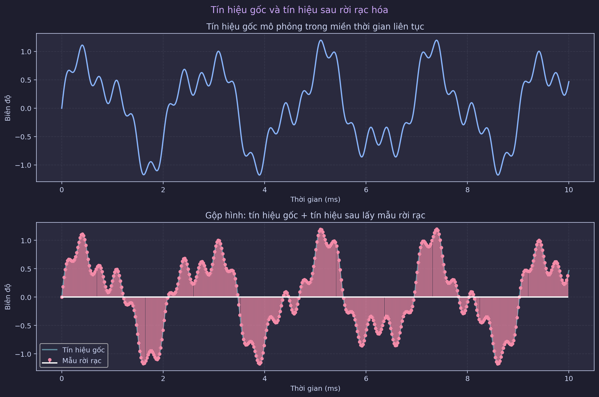
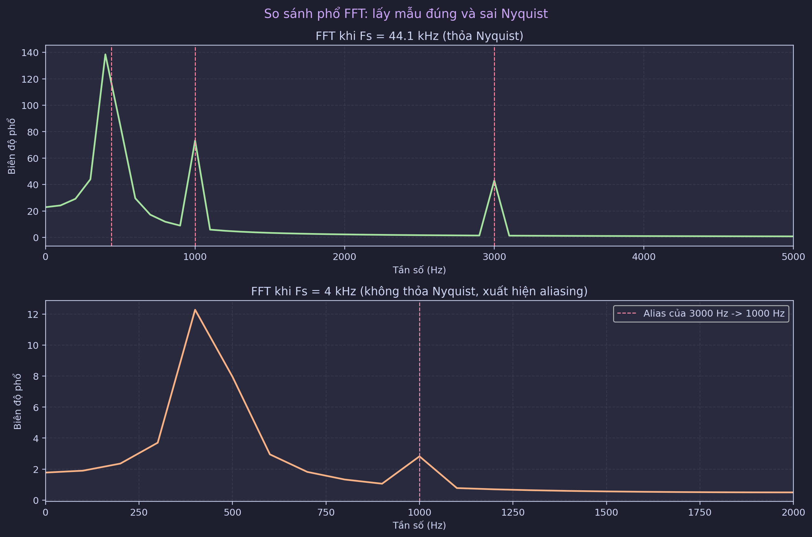
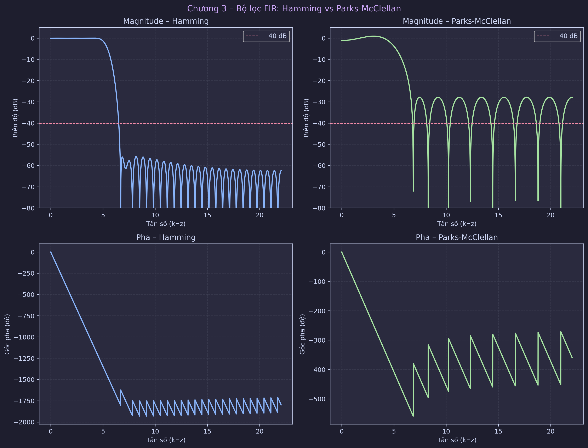
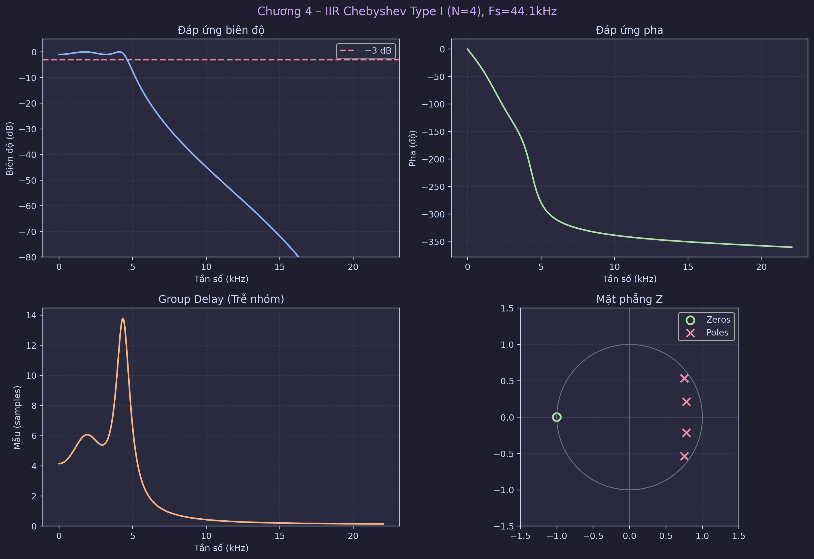
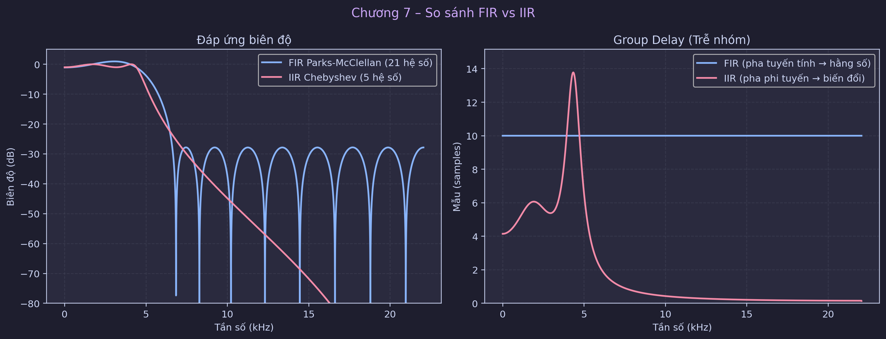
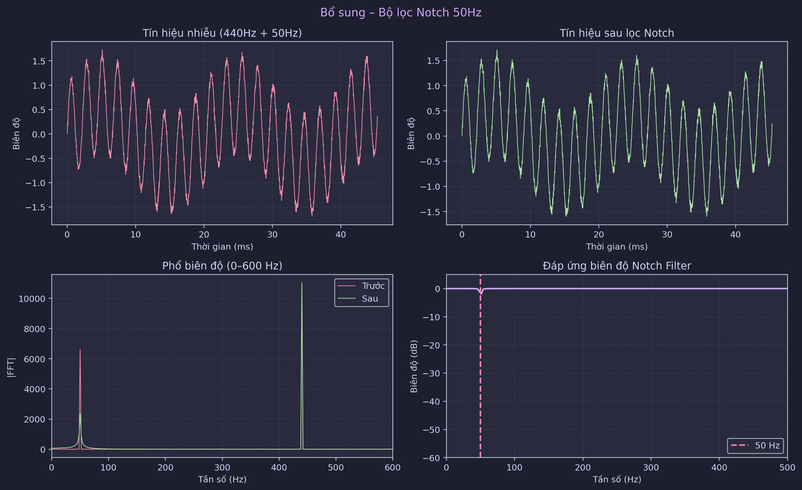
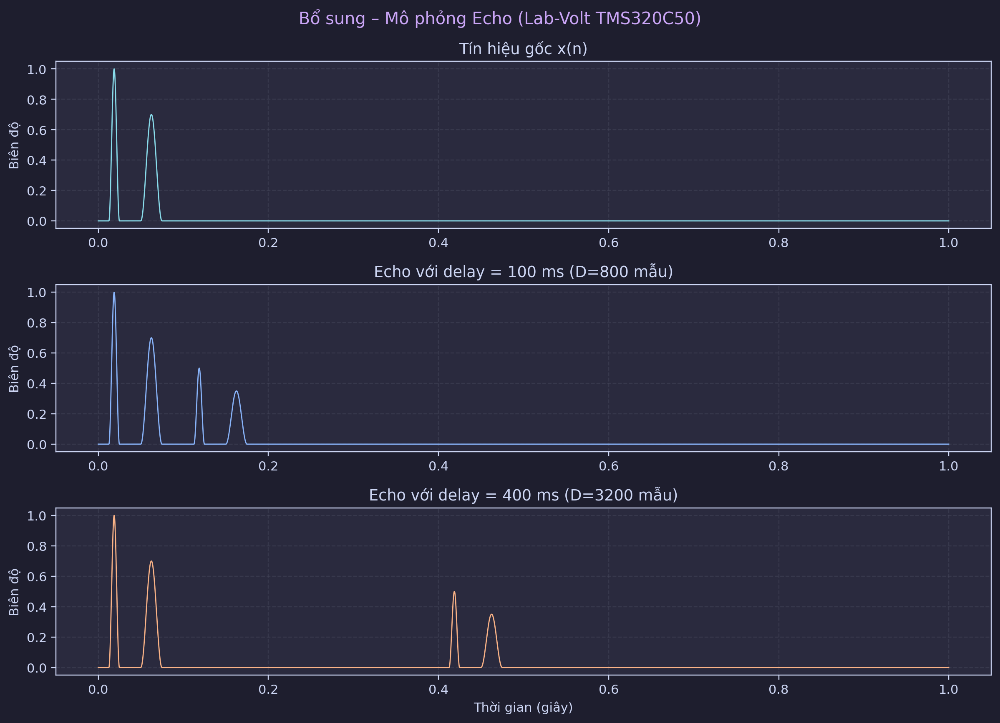

# BÁO CÁO HỢP NHẤT V1-V2-V3

## THIẾT KẾ, MÔ PHỎNG VÀ ĐÁNH GIÁ BỘ LỌC SỐ CHO TÍN HIỆU ÂM THANH

**Đơn vị:** Trường Đại học Bách Khoa Hà Nội – Viện Điện tử Viễn thông  
**Sinh viên:** Đồng Thiên Trang – MSSV 20102350  
**Môn học:** Xử lý số tín hiệu (DSP)  
**Ngày cập nhật:** 20/03/2026

---

## TÓM TẮT

Báo cáo hợp nhất này tổng hợp đầy đủ ba phiên bản trước theo một cấu trúc khoa học xuyên suốt từ lý thuyết đến triển khai. Nội dung tập trung vào thiết kế bộ lọc số FIR/IIR cho tín hiệu âm thanh, mô phỏng quá trình rời rạc hóa theo định lý Nyquist–Shannon, đánh giá hiện tượng aliasing, so sánh hiệu năng FIR và IIR, và kiểm chứng ứng dụng thực tế với bộ lọc notch 50 Hz và hiệu ứng echo.

Về mặt phương pháp, phần FIR được triển khai theo hai hướng: cửa sổ Hamming và Parks-McClellan (equiripple), còn phần IIR dùng Chebyshev Type I kết hợp tư duy bilinear/pre-warp. Về mặt kỹ thuật phần mềm, chương trình đã được mô-đun hóa hoàn chỉnh bằng Python/SciPy/Matplotlib, hỗ trợ chạy tương tác, chạy headless và tự động xuất toàn bộ hình vào `imgaes/v3/` phục vụ báo cáo.

Kết quả cho thấy: (i) điều kiện Nyquist được thỏa với $F_s=44.1$ kHz cho tín hiệu có $f_{max}=3$ kHz; (ii) khi vi phạm Nyquist (ví dụ $F_s=4$ kHz), thành phần 3 kHz bị alias về 1 kHz; (iii) IIR đạt bậc thấp hơn đáng kể so với FIR nhưng đánh đổi pha phi tuyến; (iv) notch 50 Hz cải thiện SNR rõ rệt, từ khoảng 4.37 dB lên 11.33 dB.

---

## 1. GIỚI THIỆU VÀ BỐI CẢNH

Sự chuyển dịch từ hệ analog sang hệ số trong xử lý âm thanh mang lại ba lợi thế chính: độ lặp lại cao, tính linh hoạt thuật toán, và khả năng tối ưu hóa trên phần cứng DSP. Trong bối cảnh này, hai lớp bộ lọc chủ đạo là FIR và IIR luôn đóng vai trò trung tâm.

- **FIR** phù hợp khi ưu tiên pha tuyến tính và độ trung thực dạng sóng.
- **IIR** phù hợp khi ưu tiên hiệu quả tính toán (ít phép MAC, bậc thấp).

Liên hệ phần cứng thực nghiệm: TMS320C50 (fixed-point DSP) và hệ Lab-Volt DSP cho thấy các quyết định thiết kế bộ lọc không chỉ mang tính học thuật mà còn tác động trực tiếp đến tài nguyên phần cứng thời gian thực.

---

## 2. MỤC TIÊU NGHIÊN CỨU

1. Thiết kế và mô phỏng bộ lọc số cho tín hiệu âm thanh theo thông số kỹ thuật cho trước.
2. Xây dựng pipeline phân tích tín hiệu từ mô phỏng tín hiệu gốc, rời rạc hóa, đánh giá Nyquist đến phân tích phổ.
3. So sánh FIR và IIR trên các tiêu chí: bậc lọc, đáp ứng biên độ, pha, trễ nhóm, ổn định.
4. Kiểm chứng hai ứng dụng thực tế:
   - Khử nhiễu điện lưới bằng notch 50 Hz.
   - Mô phỏng hiệu ứng echo theo mô hình trễ.
5. Chuẩn hóa hệ thống mã nguồn thành kiến trúc module, dễ debug và tái sử dụng.

---

## 3. CƠ SỞ LÝ THUYẾT

## 3.1 Hệ LTI rời rạc

Mô hình tổng quát của hệ tuyến tính bất biến theo thời gian:

$$
y(n)=\sum_{i=0}^{M} b_i x(n-i)-\sum_{j=1}^{N} a_j y(n-j)
$$

Năng lượng tín hiệu:

$$
E_x=\sum_n |x(n)|^2
$$

## 3.2 Biến đổi Z và ổn định

Hàm truyền đạt:

$$
H(z)=\frac{B(z)}{A(z)}
$$

Điều kiện ổn định BIBO của hệ rời rạc nhân quả: mọi pole phải nằm trong vòng tròn đơn vị, tức $|p_k|<1$.

## 3.3 Phân loại bộ lọc theo đáp ứng tần số

- Thông thấp (Low-pass)
- Thông cao (High-pass)
- Thông dải (Band-pass)
- Chắn dải (Band-stop / Notch)

## 3.4 Biến đổi song tuyến và pre-warp

Trong thiết kế IIR dựa trên analog prototype:

$$
\Omega=\frac{2}{T}\tan\left(\frac{\omega}{2}\right)
$$

Công thức này dùng để pre-warp tần số trước khi ánh xạ bilinear, giúp giữ đúng điểm cắt mục tiêu trong miền số.

---

## 4. PHÂN TÍCH TÍN HIỆU INPUT VÀ ĐIỀU KIỆN LẤY MẪU

## 4.1 Bài toán low-pass âm thanh

Thông số thiết kế:

- $F_s=44.1$ kHz
- $\omega_p=0.2\pi$
- $\omega_s=0.3\pi$

Đổi sang tần số vật lý:

$$
f_p=\frac{\omega_pF_s}{2\pi}=4410\ \text{Hz}
$$

$$
f_s=\frac{\omega_sF_s}{2\pi}=6615\ \text{Hz}
$$

## 4.2 Mô phỏng tín hiệu gốc và rời rạc hóa

Tín hiệu gốc mô phỏng gồm 3 thành phần: 440 Hz, 1000 Hz, 3000 Hz.  
Rời rạc hóa theo:

$$
x[n]=x(nT_s),\quad T_s=\frac{1}{F_s}
$$

Hình minh họa:



## 4.3 Kiểm tra Nyquist–Shannon và aliasing

Với $f_{max}=3000$ Hz, điều kiện Nyquist yêu cầu:

$$
F_s\ge 2f_{max}=6000\ \text{Hz}
$$

Do $F_s=44100$ Hz nên điều kiện được thỏa.  
Phản ví dụ với $F_s=4000$ Hz cho thấy thành phần 3000 Hz alias về 1000 Hz.

Hình FFT so sánh:



---

## 5. THIẾT KẾ FIR

## 5.1 FIR dùng cửa sổ Hamming

Bậc ước lượng:

$$
M=\left\lceil\frac{6.6\pi}{\Delta\omega}\right\rceil
$$

Với $\Delta\omega=0.1\pi$, thu được $M=66$.

Đặc điểm:

- Ưu điểm: ổn định, dễ triển khai, pha tốt.
- Nhược điểm: cần nhiều hệ số hơn phương pháp tối ưu.

## 5.2 FIR Parks-McClellan (equiripple)

Thiết kế bằng `remez` với ràng buộc ripple dải thông và suy giảm dải chắn.  
Kết quả thực nghiệm cho bậc xấp xỉ 20, nhỏ hơn rõ rệt so với Hamming.

Hình so sánh:



---

## 6. THIẾT KẾ IIR CHEBYSHEV TYPE I

Ràng buộc thiết kế:

- $R_p=1$ dB
- $R_s=15$ dB

`cheb1ord` cho bậc tối thiểu $N=4$.  
Pre-warp tương ứng:

- $\Omega_p \approx 28657.92$ rad/s
- $\Omega_s \approx 44940.14$ rad/s

Hình đáp ứng và mặt phẳng Z:



Nhận xét:

- Độ dốc tốt với bậc thấp.
- Group delay không hằng (pha phi tuyến).
- Hệ ổn định vì pole trong vòng tròn đơn vị.

---

## 7. SO SÁNH FIR VÀ IIR

Hình so sánh trực quan:



Bảng tóm tắt:

| Tiêu chí | FIR | IIR |
| --- | --- | --- |
| Bậc lọc | Cao hơn | Thấp hơn |
| Pha | Tuyến tính tốt | Phi tuyến |
| Ổn định | Luôn ổn định | Cần kiểm tra pole |
| Chi phí tính toán | Lớn hơn | Nhỏ hơn |
| Ứng dụng phù hợp | Audio Hi-Fi | Hệ thống hạn chế tài nguyên |

Kết luận kỹ thuật: không có lựa chọn tuyệt đối tốt nhất; cần chọn theo tiêu chí ưu tiên giữa trung thực pha và hiệu quả tính toán.

---

## 8. ỨNG DỤNG THỰC TẾ

## 8.1 Notch 50 Hz

Bài toán: tín hiệu 440 Hz bị nhiễu điện lưới 50 Hz.  
Bộ lọc sử dụng: `iirnotch(50 Hz, Q=30)`.

Hình kết quả:



SNR cải thiện:

- Trước lọc: ~4.37 dB
- Sau lọc: ~11.33 dB

## 8.2 Echo

Mô hình:

$$
y(n)=x(n)+\alpha x(n-D)
$$

với các mức trễ 100/200/400 ms.

Hình mô phỏng:



---

## 9. KIẾN TRÚC PHẦN MỀM VÀ QUY TRÌNH TÁI LẬP

## 9.1 Kiến trúc module

- Điều phối: `modules/demo_runner.py`
- Sampling + Nyquist: `modules/sampling_demo.py`
- Thao tác tín hiệu: `modules/signal_ops.py`
- Z-transform: `modules/z_analysis.py`
- FIR: `modules/fir_filters.py`
- IIR: `modules/iir_filters.py`
- So sánh FIR-IIR: `modules/comparison.py`
- Ứng dụng notch/echo: `modules/applications.py`
- Cấu hình và lưu hình: `modules/plot_config.py`

## 9.2 Lệnh chạy

Chạy hiển thị tương tác:

```bash
python dsp_audio_filter.py
```

Chạy headless + lưu ảnh:

```bash
python dsp_audio_filter.py --no-plots --save-plots-dir imgaes/v3
```

---

## 10. ĐÓNG GÓP MỚI SAU HỢP NHẤT 3 VERSION

1. Chuẩn hóa mạch nội dung khoa học từ lý thuyết đến kiểm chứng thực nghiệm.
2. Hợp nhất cả chiều sâu học thuật (Report), chiều sâu kiến trúc code (V2), và chiều sâu minh họa định lượng bằng hình (V3).
3. Bổ sung khối kiểm chứng Nyquist + aliasing rõ ràng bằng phản ví dụ FFT.
4. Chuẩn bị sẵn dữ liệu hình ảnh để phục vụ báo cáo học thuật và trình bày bảo vệ.

---

## 11. KẾT LUẬN VÀ HƯỚNG PHÁT TRIỂN

Bản hợp nhất V1-V2-V3 đã đạt mục tiêu xây dựng một báo cáo nhất quán, khoa học và có khả năng tái lập cao. Hệ thống mô phỏng Python hiện không chỉ thay thế được phần MATLAB cốt lõi mà còn mở rộng tốt cho quy trình phân tích thực nghiệm bằng hình ảnh và chỉ số.

Hướng phát triển tiếp theo:

1. Đọc/ghi trực tiếp file WAV thực tế để đánh giá trên dữ liệu ngoài phòng thí nghiệm.
2. Thêm adaptive filter (LMS/RLS) cho bài toán khử vọng chủ động.
3. Chuẩn hóa bộ test tự động cho từng module DSP.
4. Mở rộng sang xử lý đa kênh và pipeline thời gian thực.

---

## 12. TÀI LIỆU THAM KHẢO

1. A. V. Oppenheim, R. W. Schafer, *Digital Signal Processing*, Prentice Hall.  
2. J. G. Proakis, D. G. Manolakis, *Digital Signal Processing: Principles, Algorithms, and Applications*.  
3. Texas Instruments, *TMS320C5x User Guide*.  
4. Lab-Volt, *Digital Signal Processing Training System Manual*.  
5. Tài liệu môn học DSP, Viện Điện tử Viễn thông, BKHN.
