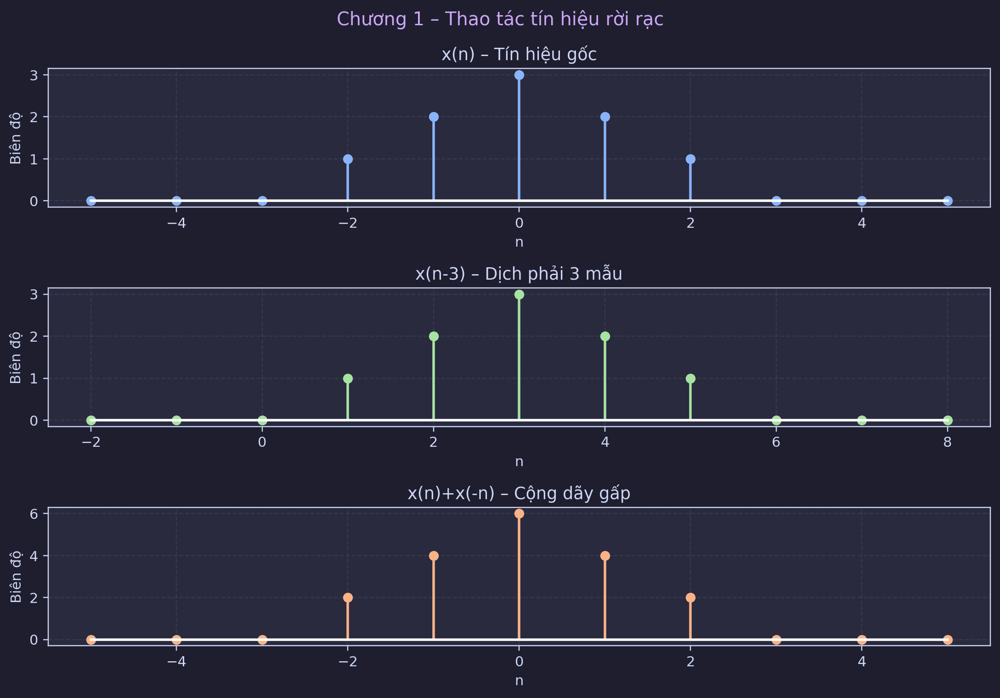
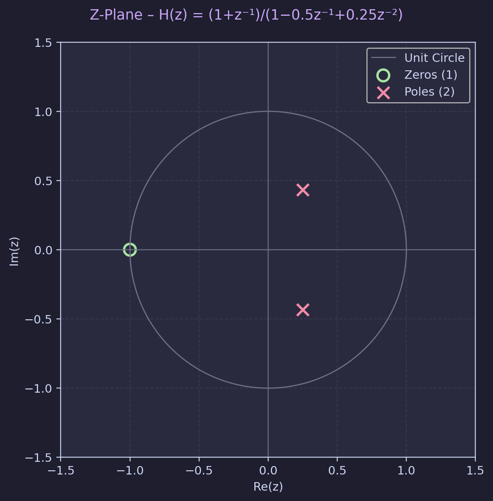

# BÁO CÁO VERSION 3 — MÔ PHỎNG DSP ÂM THANH (PYTHON/SciPy)

## 1) Mục tiêu bản V3

Version 3 tập trung vào 3 điểm nâng cấp chính:

1. Tự động xuất toàn bộ biểu đồ ra thư mục `imgaes/v3/`.
2. Bổ sung khối mô phỏng tín hiệu gốc → rời rạc hóa → kiểm tra Nyquist-Shannon.
3. Báo cáo chi tiết theo chuỗi logic: phân tích input → chọn bộ lọc → tính tham số → kiểm chứng bằng đồ thị.

---

## 2) Cách chạy để tái tạo ảnh

```bash
python dsp_audio_filter.py --no-plots --save-plots-dir imgaes/v3
```

Ý nghĩa:

- `--no-plots`: chạy headless (không bật cửa sổ matplotlib).
- `--save-plots-dir imgaes/v3`: lưu ảnh biểu đồ vào thư mục yêu cầu.

---

## 3) Danh sách ảnh đã xuất

1. `imgaes/v3/01_sampling_time_domain.png`
2. `imgaes/v3/02_sampling_fft_aliasing.png`
3. `imgaes/v3/03_signal_ops_discrete.png`
4. `imgaes/v3/04_zplane_hz.png`
5. `imgaes/v3/05_fir_hamming_vs_pm.png`
6. `imgaes/v3/06_iir_response.png`
7. `imgaes/v3/07_fir_vs_iir_compare.png`
8. `imgaes/v3/08_notch_50hz.png`
9. `imgaes/v3/09_echo_demo.png`

---

## 4) Phần A — Tín hiệu gốc và rời rạc hóa

### A.1 Mô hình tín hiệu gốc

Tín hiệu gốc mô phỏng gồm 3 thành phần sin:

- 440 Hz
- 1000 Hz
- 3000 Hz

Đây là tín hiệu tổng hợp có phổ đa thành phần, phù hợp để kiểm tra quá trình lấy mẫu.

### A.2 Phương pháp rời rạc hóa

Sử dụng lấy mẫu đều theo thời gian:

$$
x[n] = x(nT_s), \quad T_s = \frac{1}{F_s}
$$

với $F_s = 44.1\,$kHz.

### A.3 Kết quả trực quan


Giải thích:

- Hình trên: tín hiệu gốc liên tục mô phỏng.
- Hình dưới: gộp tín hiệu gốc và các mẫu rời rạc (`stem`) để thấy trực quan quá trình rời rạc hóa.

---

## 5) Phần B — Nyquist-Shannon và aliasing

### B.1 Kiểm tra điều kiện lấy mẫu

- $f_{max} = 3000\,$Hz
- yêu cầu Nyquist: $F_s \ge 2f_{max} = 6000\,$Hz
- thực tế: $F_s = 44100\,$Hz

Kết luận: thỏa Nyquist-Shannon.

### B.2 Phản ví dụ aliasing

Thêm case lấy mẫu sai với $F_s = 4000\,$Hz:

- Nyquist lúc này là $2000\,$Hz.
- Thành phần 3000 Hz vượt Nyquist và bị gấp phổ về khoảng 1000 Hz.

### B.3 Kết quả phổ FFT


Giải thích:

- Hình trên: phổ đúng (không aliasing) khi $F_s=44.1\,$kHz.
- Hình dưới: xuất hiện aliasing khi $F_s=4\,$kHz.

---

## 6) Phần C — Thao tác tín hiệu rời rạc cơ bản

Các phép minh họa:

- Dịch tín hiệu (`sigshift`)
- Gấp tín hiệu (`sigfold`)
- Cộng hai tín hiệu khác miền chỉ số (`sigadd`)



Ý nghĩa: đây là khối nền tảng để đảm bảo các biến đổi theo thời gian/chỉ số hoạt động chính xác trước khi sang thiết kế lọc.

---

## 7) Phần D — Biến đổi Z và ổn định hệ

Hàm truyền ví dụ được phân tích qua `residuez`, sau đó vẽ zero-pole.



Nhận xét:

- Pole nằm trong vòng tròn đơn vị.
- Hệ ổn định trong miền rời rạc.

---

## 8) Phần E — Thiết kế FIR

### E.1 FIR Hamming

Bậc ước lượng theo công thức:

$$
M = \left\lceil \frac{6.6\pi}{\Delta\omega} \right\rceil
$$

Với $\omega_p=0.2\pi$, $\omega_s=0.3\pi$:

- $\Delta\omega = 0.1\pi$
- $M = 66$

### E.2 FIR Parks-McClellan

Thiết kế equiripple tối ưu bằng `remez`, đạt số hệ số ít hơn cho chỉ tiêu tương đương.


Nhận xét:

- Cả hai đều là FIR nên có lợi thế pha tốt.
- Parks-McClellan cho cấu trúc gọn hơn.

---

## 9) Phần F — Thiết kế IIR Chebyshev Type I

Thông số:

- $R_p = 1$ dB
- $R_s = 15$ dB
- Bậc tối thiểu từ `cheb1ord`: $N=4$

Pre-warp bilinear:

- $\Omega_p \approx 28657.92\,$rad/s
- $\Omega_s \approx 44940.14\,$rad/s


Nhận xét:

- Đáp ứng dốc với bậc thấp.
- Group delay không hằng (pha phi tuyến).
- Pole nằm trong vòng tròn đơn vị → ổn định.

---

## 10) Phần G — So sánh FIR và IIR


Kết luận so sánh:

- FIR: pha tuyến tính tốt hơn, nhưng thường cần nhiều hệ số.
- IIR: tiết kiệm tính toán, nhưng pha phi tuyến.

---

## 11) Phần H — Ứng dụng notch 50 Hz

Bài toán: tín hiệu 440 Hz bị nhiễu điện lưới 50 Hz.


Kết quả:

- SNR trước lọc: ~4.37 dB
- SNR sau lọc: ~11.33 dB

Notch filter loại nhiễu hẹp băng hiệu quả mà không làm mất đáng kể thành phần hữu ích.

---

## 12) Phần I — Ứng dụng echo

Mô hình:

$$
y(n)=x(n)+\alpha x(n-D)
$$

với các mức delay 100/200/400 ms để mô phỏng phản xạ âm thanh.


Nhận xét:

- Delay tăng thì tiếng vọng xuất hiện muộn hơn.
- Hệ số decay quyết định cường độ tiếng vọng.

---

## 13) Tổng kết kỹ thuật

Chuỗi xử lý trong V3 đã hoàn chỉnh:

1. Mô phỏng tín hiệu gốc.
2. Rời rạc hóa và kiểm tra Nyquist-Shannon.
3. Chứng minh aliasing bằng phản ví dụ và FFT.
4. Thiết kế FIR/IIR theo thông số kỹ thuật.
5. So sánh định lượng và trực quan.
6. Kiểm chứng ứng dụng thực tế: notch và echo.

Với bộ ảnh trong `imgaes/v3/`, báo cáo này có thể dùng trực tiếp cho phần trình bày kỹ thuật hoặc nộp kèm đồ án.
